> ## Prerequisites
> * **Webin File Loader** needs to be installed on your computer previous to the exercise.
>
> * This sequence file needs to be downloaded previous to the exercise: **[A_Wt](ftp://ftp.sra.ebi.ac.uk/vol1/fastq/ERR418/004/ERR4185834/ERR4185834.fastq.gz)**
>
>   Put it e.g. in a folder named dm-practices-data on your Desktop, and name the file `A_Wt.fastq.gz`
>
> * This excercise uses a previously created spreadsheet (ENA_samples_workshop_DM_practices.tsv) from the OpenRefine module in order to submit the sample metadata. This spreadsheet needs to be completed with two lines at the top of the file: 
>
>   #checklist_accession	ERC000011
>
>   #unique_name_prefix
>
>   **Note:** There is a tab between `#checklist_accession` and `ERC000011`
>
>   Either add these two lines using an editor or download [this file](../files/ENA_samples_workshop_DM_practices.tsv), where we have done the addition already.
{: .prereq}

## Do an interactive submission to ENA
* Interactive submission is recommended for registration of your Study and Samples and for small scale Read or Sequence submission.
* Use the test submission site when you want to test, and the production site for real submissions:
    * Test site: [https://wwwdev.ebi.ac.uk/ena/submit/sra](https://wwwdev.ebi.ac.uk/ena/submit/sra)
    * Production site: [https://www.ebi.ac.uk/ena/submit/sra](https://www.ebi.ac.uk/ena/submit/sra)
    * *Note: The test service is restarted every night, any submissions made to the test service will be removed by the following day. Hence, do not start a test submission one day, and expect to continue the next day.*

* Submission steps:
    1. File upload - Upload your sequence data to upload area at EBI
    2. New submission 
    3. Register study - Provide study level information
    4. Register sample(s) - Provide sample metadata
    5. Submit sequence read(s) - Link the sequencing data to the sample metadata

### 1. File upload
You must upload data files into your private Webin file upload area at EMBL-EBI **before** you can submit the files through the Webin submission service. We will use Webin File Loader. *Note: for other upload options, please see **[ENA documentation](https://ena-docs.readthedocs.io/en/latest/submit/fileprep/upload.html#file-upload-options)***

1. Launch the Webin File Loader application.

> ## On windows
> * On Windows, start typing Webin, in the Search field (bottom left in your task bar)
> 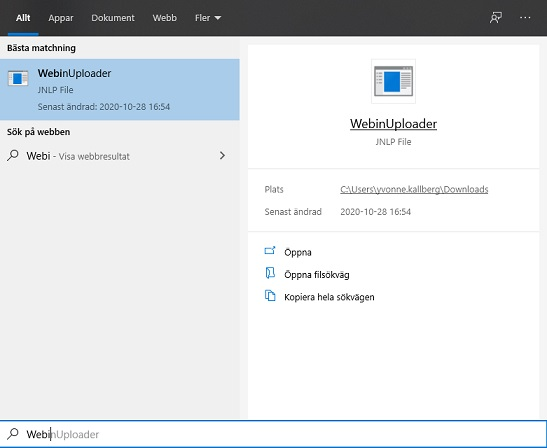
> * Select WebinUploader from the search result.
{: .solution}

> ## On Mac
> * In order to run the File Uploader application, open your file explorer and go to the directory where the `WebinUploader.jnlp` file has been saved.
>
> * While pressing the <kbd>Ctrl</kbd> button, select the WebinUploader.jnlp file then select the `Open` option.
>
> * The following dialog will now be displayed:
>
> 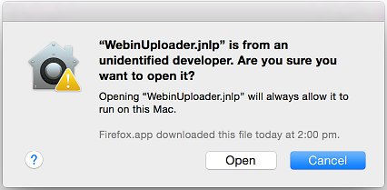
>
> * Now select the `Open` button. This will launch the application.
{: .solution}

2. Enter your Webin username in the `Username` field.
3. Enter your Webin password in the `Password` field.
4. Browse into the local ´Upload Directory` containing the data files you wish to upload using the ... button.
5. Click `okay` to see the list of all the files contained in the selected directory displayed in the Webin File Uploader window
6. Choose `Overwrite` option if you wish to replace any existing files which have been previously uploaded.
7. Choose `Upload Tree` option if you wish to preserve the directory structure when uploading files to the Webin upload area. By default, the files will be uploaded into the root directory of your Webin upload area.
8. Select the files to upload. You can use the `Select All` button to select all the files for upload.
9. Click on the `Upload` button.

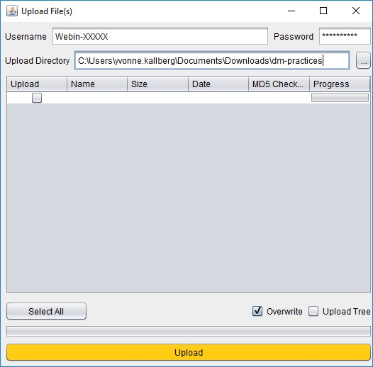

### 2. New submission
* Go to the test service: [https://wwwdev.ebi.ac.uk/ena/submit/sra](https://wwwdev.ebi.ac.uk/ena/submit/sra) and log in with your Webin username and password. 
* Go to the `New Submission` tab. Each of the options displayed will lead you to interactive web forms that guide you through the submission of these objects. Interactive submission is recommended for registration of your Study and Samples.
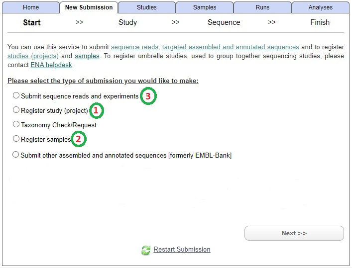

### 3. [Register study (project)](https://ena-docs.readthedocs.io/en/latest/submit/study/interactive.html) 
> ## Picture
> 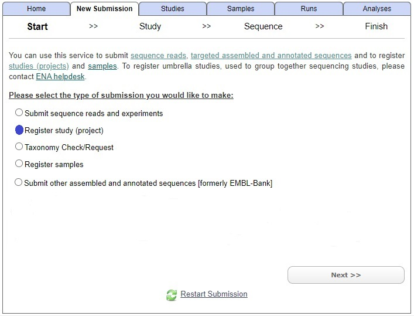
{: .solution}

* Enter the following information
    * **Release date**: 29-Dec-2021
    * **Short name**: VEGFR2
    * **Title**: VEGFR2 Y949F mutation
    * **Abstract**: RNA sequencing of lung tissue from transgenic mice in order to investigate the effect of a single tyrosine to phenylalanine exchange in the endothelial receptor VEGFR2 at position Y949.
* Click on **Submit**
* Click OK in the pop-up **Please confirm that you want to submit** window

> ## Solution
> 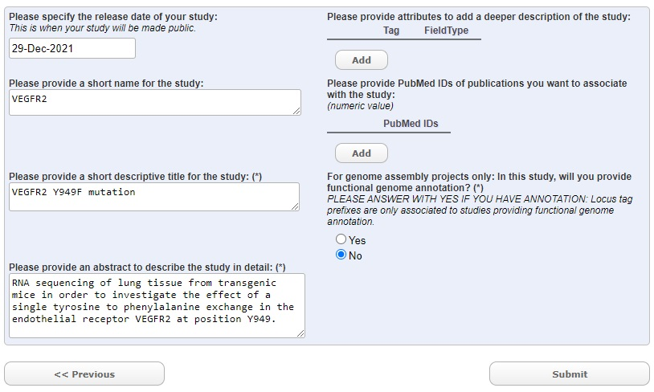
{: .solution}

### 4. [Register samples](https://ena-docs.readthedocs.io/en/latest/submit/samples/interactive.html) 
* Click on the **Home** tab and then click on the link `samples`
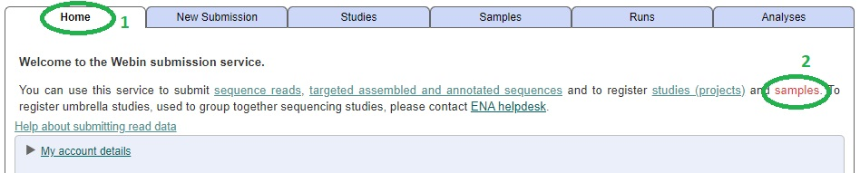
* Click on **Next**

> ## Picture
> 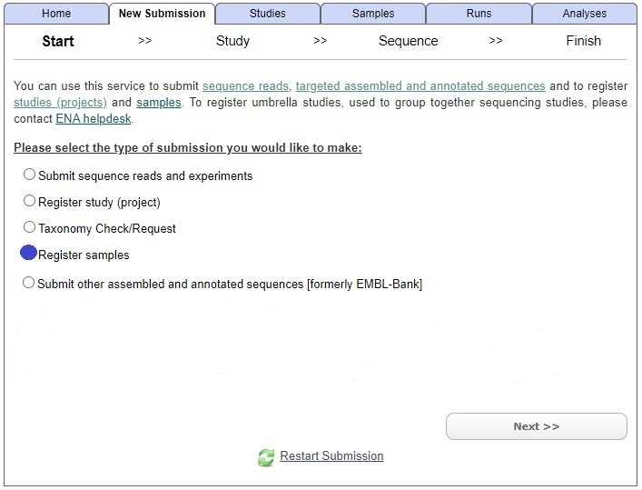
{: .solution}

* There are two ways to submit samples, either from scratch by Selecting a Checklist or to Submit a Completed Spreadsheet. 

> ## Picture
> 
{: .solution}

* Normally you do not have a spreadsheet to begin with but since we have produced one in the [OpenRefine module](https://nbisweden.github.io/module-openrefine-dm-practices/), we can skip ahead and click on `Submit Completed Spreadsheet`. 

* Select the file `ENA_samples_workshop_DM_practices.tsv` from your computer (or, if doing this excercise independent from previous course modules, download the file first from [here](../files/ENA_samples_workshop_DM_practices.tsv)).

* Now there are 6 samples to be submitted. Click on **Submit**
* Click OK in the pop-up **Please confirm that you want to submit** window

> ## Picture
> 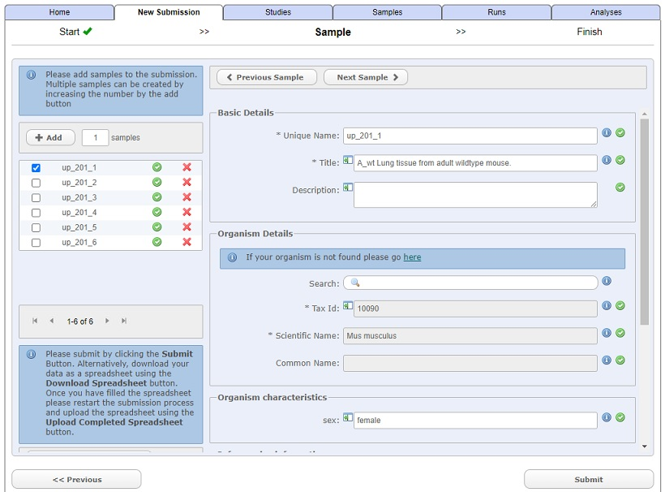
{: .solution}

> ## Optional: Steps to submit samples from scratch
> * Click on `Select Checklist`
> * Select a checklist, for our purpose the `Other Checklists`> `ENA default sample checklist` is suitable.
> * Click on **Next**
> 
> > ## Solution
> > 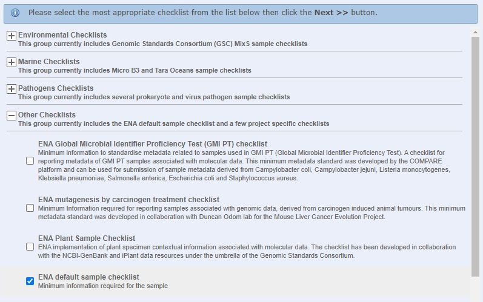
> {: .solution}
> 
> * Add two fields from **Part and developmental stage of organism**: `dev_stage` and `tissue_type`.
> * Click on **Next**
> 
> > ## Solution
> > 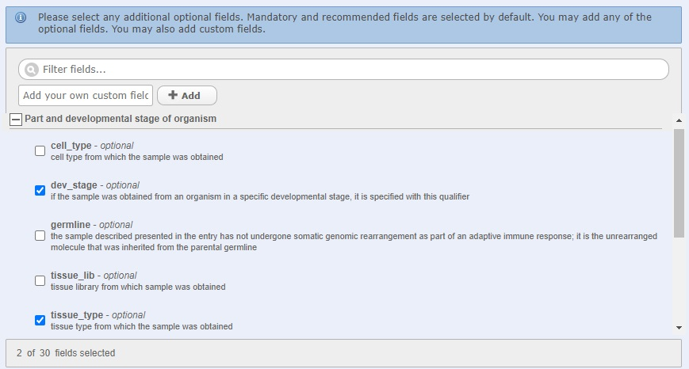
> {: .solution}
> 
> * Fill in all information that is in common for all samples
    * **Organism Details**: Search for `mouse` and choose `Mus musculus` from the search result.
    * **Part and developmental stage of organism**: `adult` as `dev_stage` and `lung` as `tissue_type`
> * Click on **Next**
> 
> > ## Solution
> > 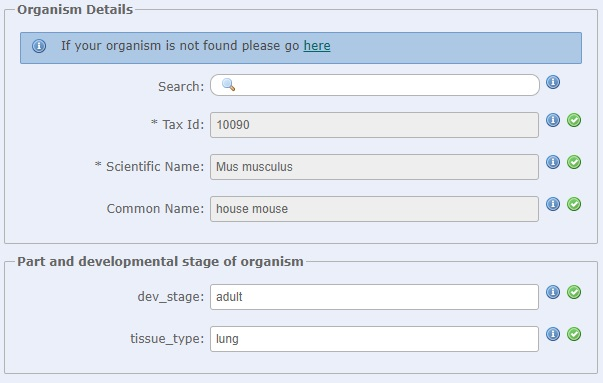
> {: .solution}
> 
> * Click on `+ Add` button and fill the Basic details
    * **Unique name**: A_Wt
    * **Title**: Sample A wildtype
> * Click on **Submit**
> * Click OK in the pop-up **Please confirm that you want to submit** window
> 
> > ## Solution
> > 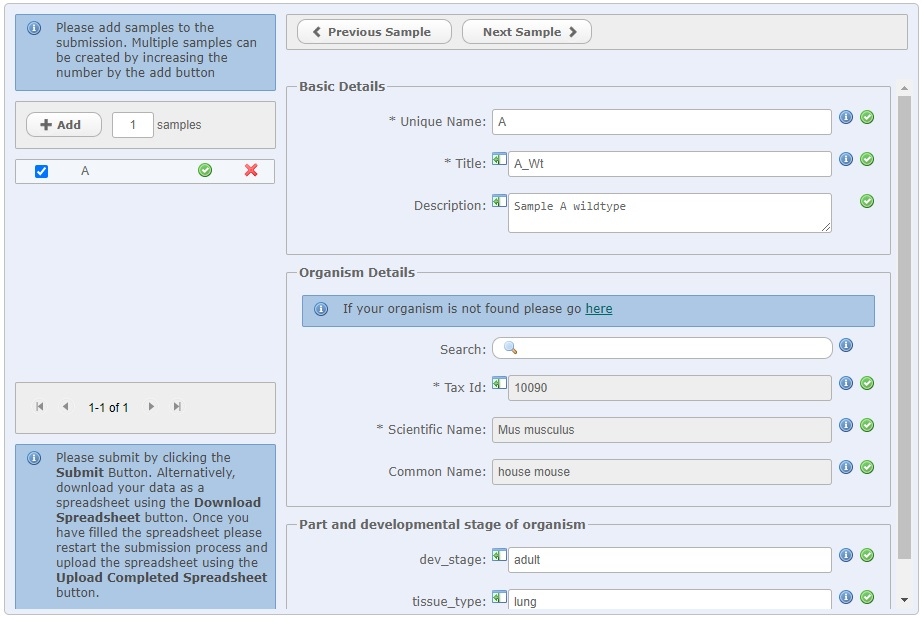
> {: .solution}
> 
> > ## Note
> This excercise only registers one sample, but typically there are many samples and it can be wise to download a template and fill it in e.g. Excel.
> {: .callout}
{: .solution}

### 5. [Submit sequence reads and experiments](https://ena-docs.readthedocs.io/en/latest/submit/reads/interactive.html)
* Click on the **Home** tab and then click on the link `sequence reads`
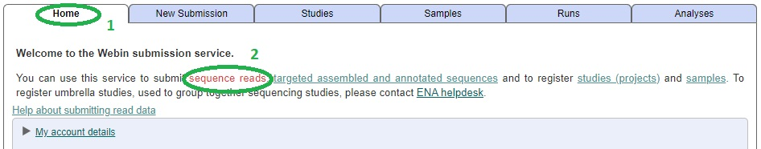
* Click on **Next**

> ## Picture
> 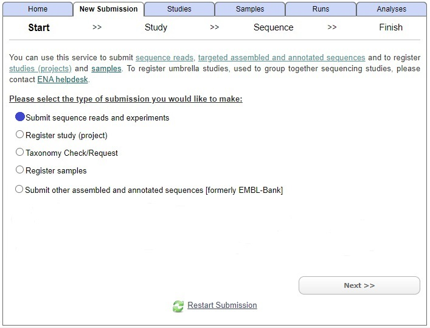
{: .solution}

* Select your Study accession (typically starting with PRJEB) and click on **Next**
* Since we already have submitted our Sample (and hence chosen checklist), click on **Skip** in the next window
* Fill in the Run information
    * Click on `One Fastq file (Single)` as file format
    * Sample reference - `A_Wt`
    * Instrument Model - `Illumina HiSeq 2500`
    * Library Source - `TRANSCRIPTOMIC`
    * Library Selection - `other`
    * Library Strategy - `RNA-Seq`
    * Library Layout - `SINGLE`
    * File Name - `A_Wt.fastq.gz `
        * *Note: When you write the file name, a green square with the file name will pop-up, click on this in order to connect this submission with the uploaded file.*
* Click **Submit**
* Click OK in the pop-up **Please confirm that you want to submit** window

> ## Solution
> 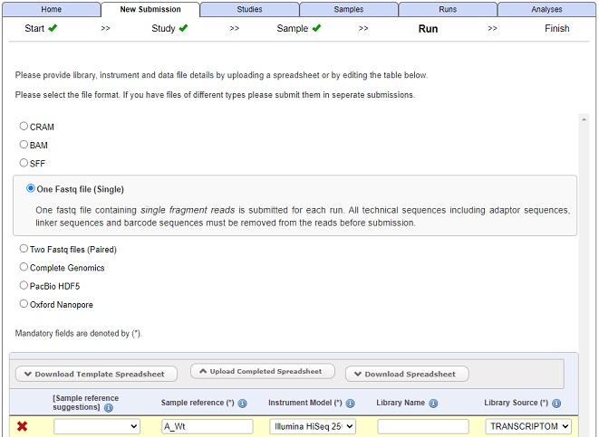
> 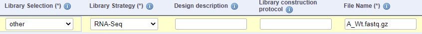
{: .solution}

> ## Note
> It is during this step that the submitted Study and Sample is connected with the uploaded sequence file(s).
{: .callout}

## ENA training material 
* [ENA quick tour](https://www.ebi.ac.uk/training-beta/online/courses/ena-quick-tour/submitting-data-to-ena/)

* [ENA webinar](https://www.ebi.ac.uk/training/online/course/european-nucleotide-archive-ena-introduction-webin) 
    * [ENA slides only](https://www.ebi.ac.uk/training/online/sites/ebi.ac.uk.training.online/files/ena_webinar_slides_030419.pptx)

* [ReadTheDocs tutorial](https://ena-docs.readthedocs.io/en/latest/)