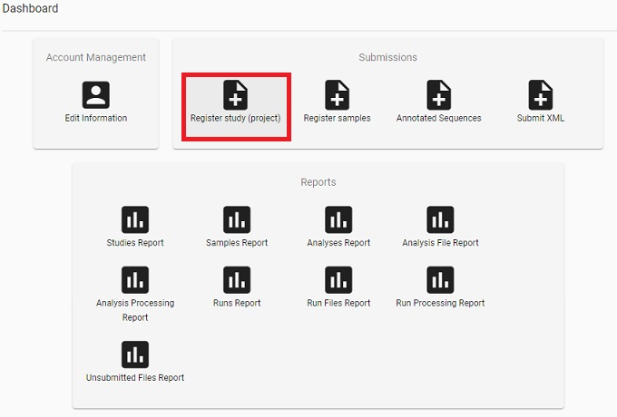
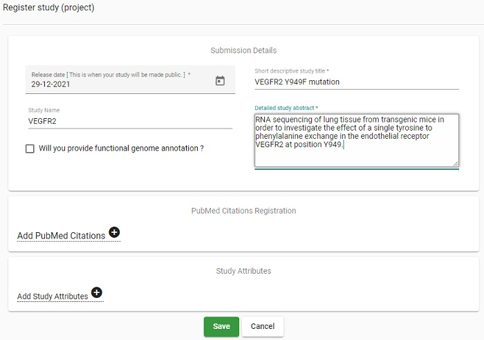
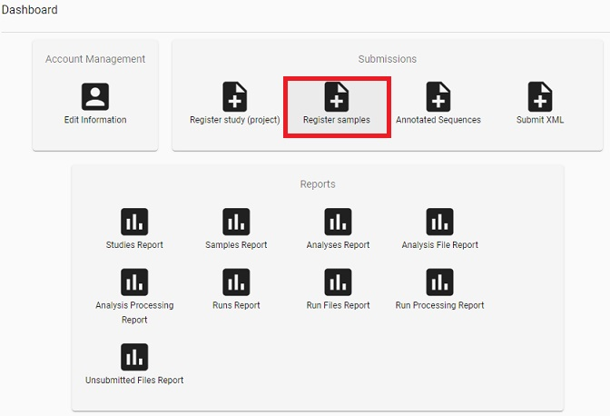
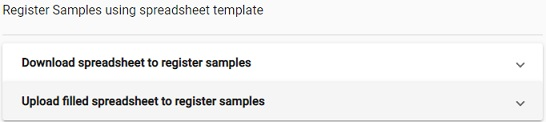
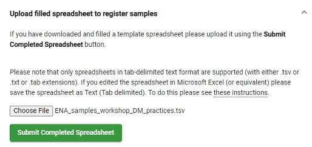
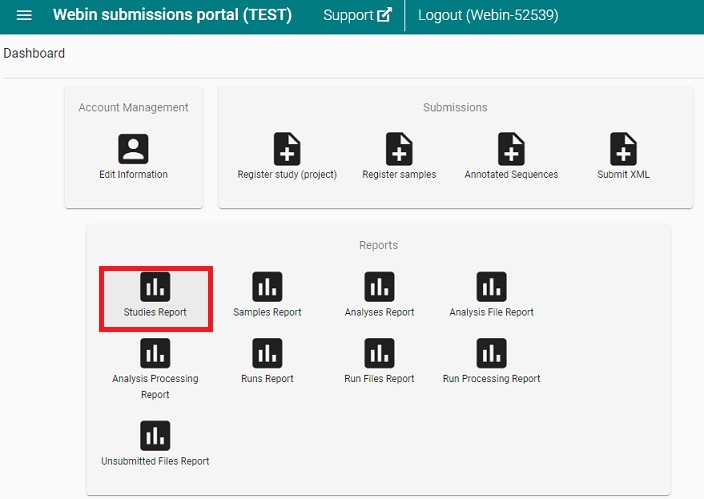
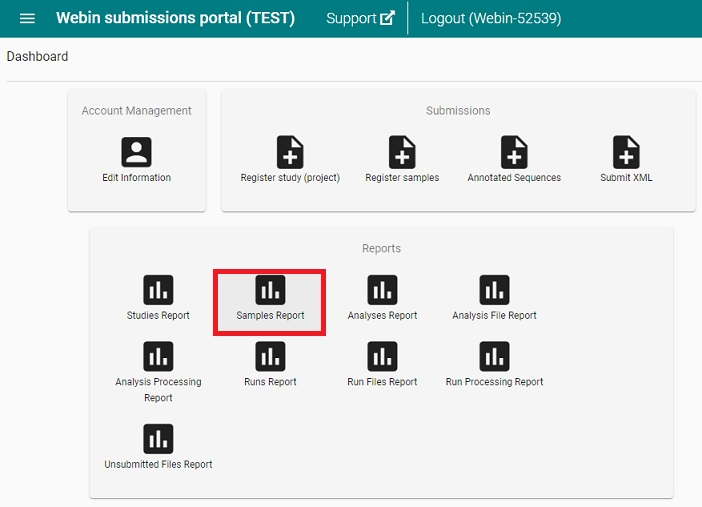

> ## Prerequisites
> * Webin-CLI requires that you have Java installed before you can run it. You should have version 1.8 or newer, which can be [downloaded from Java](https://java.com/en/download/).
>
> * You will also need to download and install [Oracle JRE](https://www.oracle.com/technetwork/java/javase/downloads/jre8-downloads-2133155.html) (Java Runtime Environment).  
> 
> * If not done already, create a folder called `dm-practices` on your Desktop. Also create the subfolders `Desktop/dm-practices/data` and `Desktop/dm-practices/prg`.
> 
> * Download Webin-CLI Java jar file from its [GitHub repository](https://github.com/enasequence/webin-cli/releases/latest), and put it in `Desktop/dm-practices/prg/`.
>
> * This sequence file needs to be downloaded previous to the exercise: **[A_Wt](ftp://ftp.sra.ebi.ac.uk/vol1/fastq/ERR418/004/ERR4185834/ERR4185834.fastq.gz)**  
>   Put it in `Desktop/dm-practices/data/` and name the file `A_Wt.fastq.gz`
{: .prereq}

## Do a submission to ENA using Webin-CLI
* Webin command line submission interface allows for automatic validation. Unlike other ENA submission routes, you do not need to pre-upload your files when using Webin-CLI.

* Use the test submission site when you want to test, and the production site for real submissions:
    * Test site: [https://wwwdev.ebi.ac.uk/ena/submit/webin](https://wwwdev.ebi.ac.uk/ena/submit/webin)
    * Production site: [https://www.ebi.ac.uk/ena/submit/webin](https://www.ebi.ac.uk/ena/submit/webin)
    * *Note: The test service is restarted every night, any submissions made to the test service will be removed by the following day. Hence, do not start a test submission one day, and expect to continue the next day.*

* Submission steps:
    1. In the browser:
       1. Login 
       2. Register study - Provide study level information
       3. Register sample(s) - Provide sample metadata
    2. Create manifest file(s) - envelope / metadata for sequence files
    3. Validate and upload manifest file(s) and sequence file(s))

### 0. Preparation of sample file
This excercise uses a previously created spreadsheet (ENA_samples_workshop_DM_practices.tsv) from the OpenRefine module in order to submit the sample metadata. This spreadsheet needs to be completed with two lines at the top of the file: 

>   #checklist_accession	ERC000011  
>   #unique_name_prefix
>
> **Note:** There is a tab between `#checklist_accession` and `ERC000011`  

* Either add these two lines using an editor such as Notepad or download **[this file](../files/ENA_samples_workshop_DM_practices.tsv)**, where we have done the addition already.

* Put the file in Desktop/dm-practices/data/

### 1. In the browser
* Go to the test service: [https://wwwdev.ebi.ac.uk/ena/submit/webin](https://wwwdev.ebi.ac.uk/ena/submit/webin) and log in with your Webin username and password. 

  

* On the Dashboard, click on Register Study (project)

  > ## Picture Dashboard Study
  > 
  {: .solution}

* Enter the following information
    * **Release date**: 29-Dec-2021
    * **Short descriptive study title**: VEGFR2 Y949F mutation
    * **Study name**: VEGFR2
    * **Detailed study abstract**: RNA sequencing of lung tissue from transgenic mice in order to investigate the effect of a single tyrosine to phenylalanine exchange in the endothelial receptor VEGFR2 at position Y949.
* Click on **Save**
* Note down the accession number (starts with PRJEB) displayed in the pop-up window, and click OK.

  > ## Solution
  > 
  {: .solution}
* On the Dashboard, click on Register Samples

  > ## Picture Dashboard Samples
  > 
  {: .solution}

* There are two ways to submit samples, either from scratch via `Download spreadsheet to register samples` or via `Upload filled spreadsheet to register samples`. 

  > ## Picture Sample Choice
  > 
  {: .solution}

* Normally you do not have a spreadsheet to begin with but since we have produced one in the [OpenRefine module](https://nbisweden.github.io/module-openrefine-dm-practices/), we can skip ahead and click on `Upload filled spreadsheet to register samples`. 

* Select the file `ENA_samples_workshop_DM_practices.tsv` from your computer (or, if doing this excercise independent from previous course modules, download the file first from [here](../files/ENA_samples_workshop_DM_practices.tsv)).

* Click on **Submit Completed Spreadsheet**

* Click OK in the pop-up window

  > ## Picture Sample Submit
  > 
  {: .solution}

### 2. [Prepare manifest file](https://ena-docs.readthedocs.io/en/latest/submit/general-guide/webin-cli.html#stage-2-prepare-the-files)

* The set of files that are part of the submission must be specified using a manifest file. The manifest file has two columns separated by a tab (or any whitespace characters):

  * Field name (first column): case insensitive field name
  * Field value (second column): field value  

* The following metadata fields are supported in the manifest file:

  * STUDY: Study accession or unique name (alias)
  * SAMPLE: Sample accession or unique name (alias)
  * NAME: Unique experiment name
  * PLATFORM: [See permitted values](https://ena-docs.readthedocs.io/en/latest/submit/reads/webin-cli.html#platform). Not needed if INSTRUMENT is provided.
  * INSTRUMENT: [See permitted values](https://ena-docs.readthedocs.io/en/latest/submit/reads/webin-cli.html#instrument)
  * INSERT_SIZE: Insert size for paired reads
  * LIBRARY_NAME: Library name (optional)
  * LIBRARY_SOURCE: [See permitted values](https://ena-docs.readthedocs.io/en/latest/submit/reads/webin-cli.html#source)
  * LIBRARY_SELECTION: [See permitted values](https://ena-docs.readthedocs.io/en/latest/submit/reads/webin-cli.html#selection)
  * LIBRARY_STRATEGY: [See permitted values](https://ena-docs.readthedocs.io/en/latest/submit/reads/webin-cli.html#strategy)
  * DESCRIPTION: free text library description (optional)

* The following file name fields are supported in the manifest file:

  * BAM: Single BAM file
  * CRAM: Single CRAM file
  * FASTQ: Single fastq file

* In a text editor such as Notepad, create a manifest file for the A_Wt sequence file, write the following information:  
  >   STUDY     
      SAMPLE    
      INSTRUMENT  Illumina HiSeq 2500  
      LIBRARY_SOURCE  TRANSCRIPTOMIC  
      LIBRARY_SELECTION   other  
      LIBRARY_STRATEGY    RNA-Seq  
      FASTQ A_Wt.fastq.gz  

  The field values for STUDY and SAMPLE needs to be collected from your submission:
* In the browser where you submitted the study and samples, go to the Dashboard and click on the `Studies Report`
  > ## Picture Dashboard Studies Report
  > 
  {: .solution}

* Copy the accession number (starting with PRJEB) into the manifest file as the STUDY field value.
* Go back to the Dashboard and click on the `Samples report`
  > ## Picture Dashboard Samples Report
  > 
  {: .solution}

* Locate the accession number (starting with ERS) for wt_A and copy this into the manifest file as the SAMPLE field value.
* Save the manifest file

  > ## Solution
  > See an example manifest file [here](../files/A_Wt_manifest.txt) but note that STUDY and SAMPLE have no field values since this is unique to each study and sample submission and needs to be entered manually.
  {: .solution}

### 3. [Validate and submit the manifest file and the sequence file](https://ena-docs.readthedocs.io/en/latest/submit/general-guide/webin-cli.html#stage-3-validate-and-submit-files)

Open the Command Prompt window and go to the folder dm-practices  on your Desktop using the command `cd Desktop\dm-practices`:

* *Note for **Mac** users: Please use forward slash, i.e. write the command `cd Desktop/dm-practices`* 

In order to use Webin-CLI we need to give instructions on who we are and what we want to do. This is done using `options`:

* In order to see which options are available, type the following command in the Command Prompt window 

  > Windows: `java -jar prg\webin-cli-3.4.0.jar -help`  
  > Mac: `java -jar prg/webin-cli-3.4.0.jar -help`

Out of these, we will make use of the following options:

`-context`: the submission type (genome, transcriptome, sequence or reads)  
`-userName`: the Webin submission account name.  
`-password`: the Webin submission account password.  
`-manifest`: the manifest file name.  
`-outputDir`: directory for output files.  
`-inputDir`: input directory for files declared in manifest file.  
`-validate`: validates the files defined in the manifest file.  
`-submit`: validates and submits the files defined in the manifest file.  
`-test`: use Webin test service instead of the production service. 
Please note that the Webin upload area is shared between test and production services, and that test submission files will not be archived.  
`-help`: detailed information about the different options.

* For more details about the command line options of Webin-CLI, please follow this link: [https://ena-docs.readthedocs.io/en/latest/submit/general-guide/webin-cli.html#command-line-options](https://ena-docs.readthedocs.io/en/latest/submit/general-guide/webin-cli.html#command-line-options). 

First we will do a validation (-validate option) to the test server (-test option), using `data` folder as both input and output directory. 
* Copy or type the command below, and replace the `Webin-XXX` and `myPassword` with your own webin username and password, respectively:

  > Windows: `java -jar prg\webin-cli-3.4.0.jar -context reads -userName Webin-XXXXX -password myPassword -manifest A_Wt_manifest.txt -outputDir data -inputDir data -validate -test`
  > 
  > Mac: `java -jar prg/webin-cli-3.4.0.jar -context reads -userName Webin-XXXXX -password myPassword -manifest A_Wt_manifest.txt -outputDir data -inputDir data -validate -test`

* Press <kbd>Enter</kbd> 
* If the validation is successful the last output row will read:  
  > INFO : The submission has been validated successfully.

* When the validation is successful, it is time to do a submit instead of a validation (-submit option instead of -validate). We will still use the test server, and the same input and output directories as for the validation step. Try to write the command yourself or take a peak at the solution below.

  > ## Solution
  >  Windows: `java -jar prg\webin-cli-3.4.0.jar -context reads -userName Webin-XXXXX -password myPassword -manifest A_Wt_manifest.txt -outputDir data -inputDir data -submit -test`
  >
  > Mac: `java -jar prg/webin-cli-3.4.0.jar -context reads -userName Webin-XXXXX -password myPassword -manifest A_Wt_manifest.txt -outputDir data -inputDir data -submit -test`
  {: .solution}

* The processing will take a while but since the validation was successful, it is only the upload of the sequence file that might misfire. Well done!

## ENA training material 
* [Webin-CLI Video Guide](https://youtu.be/ChCsqoq-r-Y)
* [ENA quick tour](https://www.ebi.ac.uk/training-beta/online/courses/ena-quick-tour/submitting-data-to-ena/)
* [ENA webinar](https://www.ebi.ac.uk/training/online/course/european-nucleotide-archive-ena-introduction-webin) 
    * [ENA slides only](https://www.ebi.ac.uk/training/online/sites/ebi.ac.uk.training.online/files/ena_webinar_slides_030419.pptx)
* [ReadTheDocs tutorial](https://ena-docs.readthedocs.io/en/latest/)