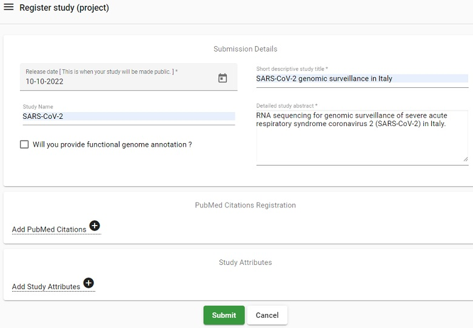
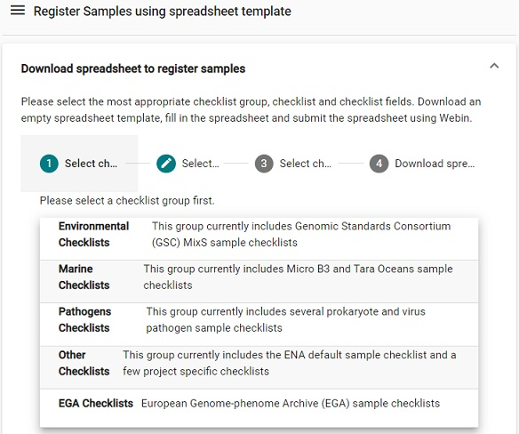
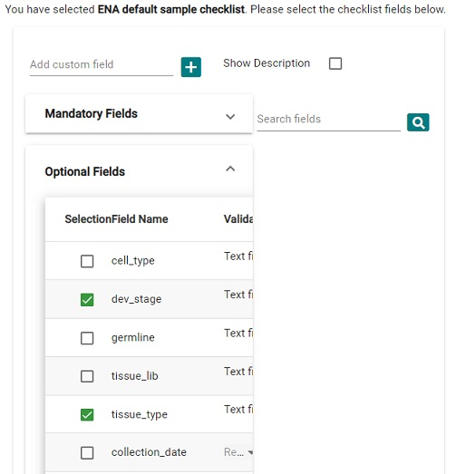

> ## Prerequisites
> This exercise requires a sample metadata spreadsheet previously created in the OpenRefine module, [`ENA_samples_workshop_DM_practices.tsv`](../data/ENA_samples_workshop_DM_practices.tsv). Create a folder on your desktop, e.g. `Desktop/dm-practices/data` and download the tsv file above by clicking on the link. 
> 
> You also need to create an account at European Nucleotide Archive:
> * Go to [ENA submit homepage](https://www.ebi.ac.uk/ena/submit/webin/#)
> * Click on **Register** and fill in the required details
{: .prereq}

## Do a submission to ENA
* In this exercise you will do an interactive submission of your Study and Samples using the Webin submissions portal. There is also an optional exercise where you will submit your sequence data using the command line submission interface Webin-CLI, which enables automatic validation.

* Use the test submission site when you want to test, and the production site for real submissions:
    * Test site: [https://wwwdev.ebi.ac.uk/ena/submit/webin](https://wwwdev.ebi.ac.uk/ena/submit/webin)
    * Production site: [https://www.ebi.ac.uk/ena/submit/webin](https://www.ebi.ac.uk/ena/submit/webin)
    * *Note: The test service is restarted every night, any submissions made to the test service will be removed by the following day. Hence, do not start a test submission one day, and expect to continue the next day.*

* Submission steps:
    1. Login to the Webin Submissions Portal
    2. Register study - Provide study level information
    3. Register sample(s) - Provide sample metadata
    4. Create manifest file(s) - envelope / metadata for sequence files
    5. Validate and upload manifest file(s) and sequence file(s))

### 1. Login to the Webin Submissions Portal
* Go to the test service: [https://wwwdev.ebi.ac.uk/ena/submit/webin](https://wwwdev.ebi.ac.uk/ena/submit/webin) and log in with your Webin username and password. 
* The submissions portal allows for interactive submission, and is the recommended way for registration of your Study and Samples. To the left, in the top of the welcome page, there is a dashboard menu which will expand when you click on it. 

  

### 2. [Register study (project)](https://ena-docs.readthedocs.io/en/latest/submit/study/interactive.html) 
* Click on the Dashboard menu and select **Register Study (Project)**

  > ## Picture
  > 
  {: .solution}

* Enter the following information
  * **Release date**: 10-Oct-2022
  * **Short descriptive study title**: SARS-CoV-2 genomic surveillance in Italy
  * **Study Name**: SARS-CoV-2
  * **Detailed study abstract**: RNA sequencing for genomic surveillance of severe acute respiratory syndrome coronavirus 2 (SARS-CoV-2) in Italy.
* Click on **Submit**
* Verify that the submission was successful in the pop-up **Submission** window, then click on **Close**

  > ## Solution
  > 
  {: .solution}

### 3. [Register samples](https://ena-docs.readthedocs.io/en/latest/submit/samples/interactive.html) 
* Click on the Dashboard menu and select **Register Samples**
  > ## Picture
  > 
  {: .solution}

* This will lead to two options, either download a spreadsheet to register samples or the reverse, i.e., upload a filled spreadsheet. Typically you do not have a spreadsheet to begin with, but since we have produced one in the [OpenRefine module](https://nbisweden.github.io/module-openrefine-dm-practices/), we can skip ahead and select the upload option.

  > ## Picture
  > 
  {: .solution}

* Select the file `ENA_samples_workshop_DM_practices.tsv` from your computer (if you haven't previously, download the file first from [here](../data/ENA_samples_workshop_DM_practices.tsv)).

* Click on **Submit Completed Spreadsheet**. 

* Verify that the submission was successful in the pop-up **Submission** window, then click on **Close**

  > ## Picture
  > 
  {: .solution}

> ## Optional: Steps to submit samples from scratch
> * From the Register Samples menu, select `Download spreadsheet to register samples`.
> * Select a checklist, for our purpose the `Pathogens Checklists` > `ENA virus pathogen reporting standard checklist` is suitable.
>   > ## Picture
>   > 
>   {: .solution}
> * Click on Recommended fields and remove the following fields: `virus identifier`, `receipt date`, `definition for seropositive sample`, `serotype`, `host habitat`, `host behaviour`, and `isolation source non-host-associated`. 
> * Click on **Next** and then on **Download TSV template**. 
> * Open the template in your favorite text editor, fill in all sample information, and then upload the file via `Dashboard > Register Samples > Upload filled spreadsheet to register samples`.
> * Verify that the submission was successful in the pop-up **Submission** window, then click on **Close**.
{: .solution}

<!-- 
> * In the [Metadata module](https://nbisweden.github.io/module-metadata-dm-practices/), we identified several ontology terms. However, there are no predefined fields for this type of metadata in the checklist so we need to add them ourselves via `Add custom fields`. Add the following fields (click on the `+` sign between):  
>
>   > ## Picture
>   > 
>   {: .solution}
-->
### 4. [(Optional) Prepare manifest file](https://ena-docs.readthedocs.io/en/latest/submit/general-guide/webin-cli.html#stage-2-prepare-the-files)

* A manifest file serves as an envelope for the sequence file, and contains the metadata describing how the sequencing was done.

* The manifest file has two columns separated by a tab (or any whitespace characters):
  * Field name (first column): case insensitive field name
  * Field value (second column): field value  

* The following metadata fields are supported in the manifest file:
  * STUDY: Study accession or unique name (alias)
  * SAMPLE: Sample accession or unique name (alias)
  * NAME: Unique experiment name
  * PLATFORM: [See permitted values](https://ena-docs.readthedocs.io/en/latest/submit/reads/webin-cli.html#platform). Not needed if INSTRUMENT is provided.
  * INSTRUMENT: [See permitted values](https://ena-docs.readthedocs.io/en/latest/submit/reads/webin-cli.html#instrument)
  * INSERT_SIZE: Insert size for paired reads
  * LIBRARY_NAME: Library name (optional)
  * LIBRARY_SOURCE: [See permitted values](https://ena-docs.readthedocs.io/en/latest/submit/reads/webin-cli.html#source)
  * LIBRARY_SELECTION: [See permitted values](https://ena-docs.readthedocs.io/en/latest/submit/reads/webin-cli.html#selection)
  * LIBRARY_STRATEGY: [See permitted values](https://ena-docs.readthedocs.io/en/latest/submit/reads/webin-cli.html#strategy)
  * DESCRIPTION: free text library description (optional)

* The following file name fields are supported in the manifest file:
  * BAM: Single BAM file
  * CRAM: Single CRAM file
  * FASTQ: Single fastq file

* In a text editor such as Notepad, create a manifest file for the NEBNext_OAS_12 sequence file and put it in the data folder (e.g. Desktop/dm-practices/data/NEBNext_OAS_12_manifest.txt), write the following information:  
  >   STUDY     
      SAMPLE    
      INSTRUMENT  NextSeq 500  
      LIBRARY_SOURCE  VIRAL RNA  
      LIBRARY_SELECTION   size fractionation  
      LIBRARY_STRATEGY    AMPLICON  
      FASTQ NEBNext_OAS_12.fastq.gz  

  The field values for STUDY and SAMPLE needs to be collected from your submission:
  * In the browser, where you submitted the study and samples, go to the Dashboard menu and click on the `Studies Report`
    > ## Picture Dashboard Studies Report
    > 
    {: .solution}

  * Copy the accession number (starting with PRJEB) into the manifest file as the STUDY field value.
  * Go back to the Dashboard menu and click on the `Samples report`
    > ## Picture Dashboard Samples Report
    > 
    {: .solution}

  * Locate the accession number (starting with ERS) for NEBNext_OAS_12 and copy this into the manifest file as the SAMPLE field value.

* Save the manifest file.

> ## Solution
> See example manifest file [NEBNext_OAS_12_manifest.txt](../data/NEBNext_OAS_12.manifest.txt) but note that STUDY and SAMPLE have no field values since this is unique to each study and sample submission and needs to be entered manually.
{: .solution}

### 5. [(Optional) Validate and submit the manifest file and the sequence file](https://ena-docs.readthedocs.io/en/latest/submit/general-guide/webin-cli.html#stage-3-validate-and-submit-files)

> ## Prerequisites
> * A sequence file is required: [NEBNext_OAS_12.fastq.gz](../data/NEBNext_OAS_12.fastq.gz), download it to you data folder (e.g. Desktop/dm-practices/data/).
> In order to submit sequence file(s), and accompanying metadata regarding the sequencing, you must install Webin-CLI:
> * Webin-CLI requires that you have Java installed before you can run it. You should have version 1.8 or newer, which can be [downloaded from Java](https://java.com/en/download/).
> * You will also need to download and install a Java Runtime Environment (JRE) and we recommend Zulu Open JDK available at [https://www.azul.com/downloads/?package=jdk](https://www.azul.com/downloads/?package=jdk)
> * In the folder where you created the data subfolder, create another subfolder named `prg`, (e.g. `Desktop/dm-practices/prg`).
> * Download Webin-CLI Java jar file from its [GitHub repository](https://github.com/enasequence/webin-cli/releases/latest), and put it in the `prg` subfolder.
{: .prereq}

Open the Command Prompt window and go to the folder `dm-practices` on your Desktop using the command `cd Desktop\dm-practices\`.

* *Note for **Mac** users: Please use forward slash, i.e. write the command `cd Desktop/dm-practices/`* 

In order to use Webin-CLI we need to give instructions on who we are and what we want to do. This is done using `options`:

* In order to see which options are available, type the following command in the Command Prompt window 

  > Windows: `java -jar prg\webin-cli-4.1.0.jar -help`  
  > Mac: `java -jar prg/webin-cli-4.1.0.jar -help`

Out of these, we will make use of the following options:

  `-context`: the submission type (genome, transcriptome, sequence or reads)  
  `-userName`: the Webin submission account name.  
  `-password`: the Webin submission account password.  
  `-manifest`: the manifest file name.  
  `-outputDir`: directory for output files.  
  `-inputDir`: input directory for files declared in manifest file.  
  `-validate`: validates the files defined in the manifest file.  
  `-submit`: validates and submits the files defined in the manifest file.  
  `-test`: use Webin test service instead of the production service. 

Please note that the Webin upload area is shared between test and production services, and that test submission files will not be archived.  

For more details about the command line options of Webin-CLI, please follow this link: [https://ena-docs.readthedocs.io/en/latest/submit/general-guide/webin-cli.html#command-line-options](https://ena-docs.readthedocs.io/en/latest/submit/general-guide/webin-cli.html#command-line-options). 

First we will do a validation (-validate option) to the test server (-test option), using `data` folder as both input and output directory. 
* Copy or type the command below, and replace the `Webin-XXX` and `myPassword` with your own webin username and password, respectively:

  > Windows: `java -jar prg\webin-cli-4.1.0.jar -context reads -userName Webin-XXXXX -password myPassword -manifest NEBNext_OAS_12_manifest.txt -outputDir data -inputDir data -validate -test`
  > 
  > Mac: `java -jar prg/webin-cli-4.1.0.jar -context reads -userName Webin-XXXXX -password myPassword -manifest NEBNext_OAS_12_manifest.txt -outputDir data -inputDir data -validate -test`

* Press <kbd>Enter</kbd> 
* If the validation is successful the last output row will read:  
  > INFO : The submission has been validated successfully.

When the validation is successful, it is time to do a submit instead of a validation (-submit option instead of -validate). We will still use the test server, and the same input and output directories as for the validation step. Try to write the command yourself or take a peak at the solution below.

  > ## Solution
  >  Windows: `java -jar prg\webin-cli-4.1.0.jar -context reads -userName Webin-XXXXX -password myPassword -manifest NEBNext_OAS_12_manifest.txt -outputDir data -inputDir data -submit -test`
  >
  > Mac: `java -jar prg/webin-cli-4.1.0.jar -context reads -userName Webin-XXXXX -password myPassword -manifest NEBNext_OAS_12_manifest.txt -outputDir data -inputDir data -submit -test`
  {: .solution}

The processing will take a while but since the validation was successful, it is only the upload of the sequence file that might misfire. Well done!

## ENA training material 
* [Webin-CLI Video Guide](https://youtu.be/ChCsqoq-r-Y)
* [ENA quick tour](https://www.ebi.ac.uk/training-beta/online/courses/ena-quick-tour/submitting-data-to-ena/)
* [ENA webinar](https://www.ebi.ac.uk/training/online/course/european-nucleotide-archive-ena-introduction-webin) 
    * [ENA slides only](https://www.ebi.ac.uk/training/online/sites/ebi.ac.uk.training.online/files/ena_webinar_slides_030419.pptx)
* [ReadTheDocs tutorial](https://ena-docs.readthedocs.io/en/latest/)

## References
The data used in this exercise has been extracted from a project submitted to ENA: [https://www.ebi.ac.uk/ena/browser/view/PRJEB42601](https://www.ebi.ac.uk/ena/browser/view/PRJEB42601)