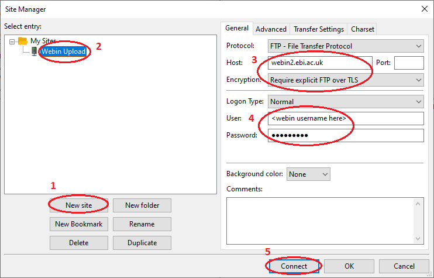
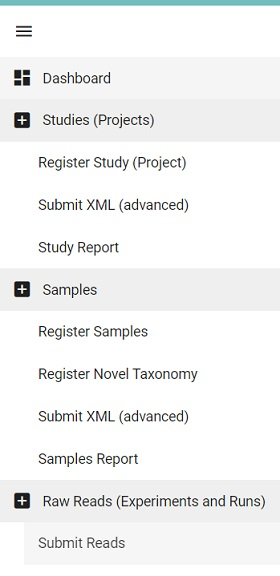
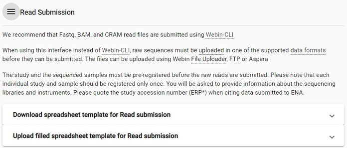
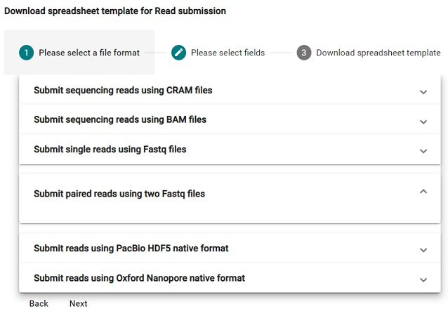
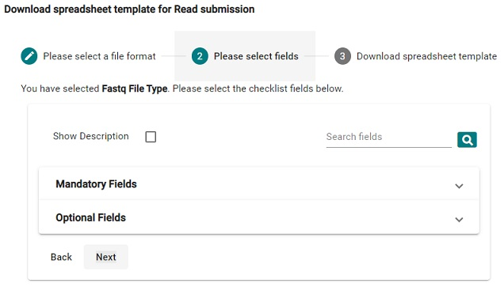
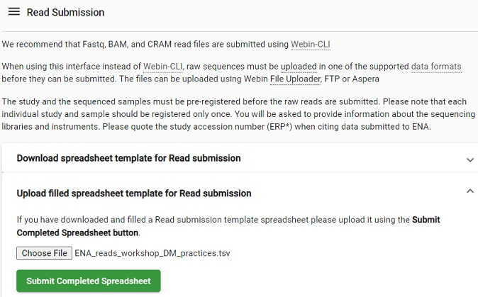

> ## Prerequisites
> * **FileZilla** needs to be installed on your computer previous to the exercise.
>
> * 3 files are needed for this exercise: 
>   1. A sequence file (fastq format) - A_Wt.fastq.gz
>   2. A checksum md5 file (which is used in order to validate the integrity of a file before and after data transfer) - A_Wt.fastq.gz.md5 
>   3. A sample metadata spreadsheet previously created in the OpenRefine module - ENA_samples_workshop_DM_practices.tsv
>   
>   All three files are found in the subfolder `dm-practices/7-repository-submission/data/`, available for download at [https://doi.org/10.17044/scilifelab.14301317](https://doi.org/10.17044/scilifelab.14301317).  
> 
{: .prereq}

## Do an interactive submission to ENA
* Interactive submission is recommended for registration of your Study and Samples and for small scale Read or Sequence submission.
* Use the test submission site when you want to test, and the production site for real submissions:
    * Test site: [https://wwwdev.ebi.ac.uk/ena/submit/webin](https://wwwdev.ebi.ac.uk/ena/submit/webin)
    * Production site: [https://www.ebi.ac.uk/ena/submit/webin](https://www.ebi.ac.uk/ena/submit/webin)
    * *Note: The test service is restarted every night, any submissions made to the test service will be removed by the following day. Hence, do not start a test submission one day, and expect to continue the next day.*

* Submission steps:
    1. File upload - Upload your sequence data to upload area at EBI
    2. Login to the Webin Submission Portal
    3. Register study - Provide study level information
    4. Register sample(s) - Provide sample metadata
    5. Submit sequence read(s) - Link the sequencing data to the sample metadata

### 1. File upload
You must upload data files into your private Webin file upload area at EMBL-EBI **before** you can submit the files through the Webin submission service. We will use FileZilla. *Note: for other upload options, please see **[ENA documentation](https://ena-docs.readthedocs.io/en/latest/submit/fileprep/upload.html#file-upload-options)***

1. Launch the FileZilla application.
2. Use the binary mode: `Transfer menu -> Transfer Type -> Binary`.
3. Open the `Site Manager` menu: `File -> Site Manager` (or by pressing `Ctrl + S`).
4. Use the `New Site` option.
5. Enter details to match those in the screenshot, adding your own Webin username and password:
  
6. Click `Connect`. *Note: If a window with 'Unknown certificate' appears, click OK.*
7. Navigate to the downloaded sequence file (and it's checksum file) using the tree on the left panel (e.g. Desktop/dm-practices/7-repository-submission/data/).
8. Drag and drop the files `A_Wt.fastq.gz` and `A_Wt.fastq.gz.md5` from the lower left panel to the lower right panel.
9. Once your transfer is successful (will take a few minutes), close the application.

### 2. Login to the Webin Submission Portal
* Go to the test service: [https://wwwdev.ebi.ac.uk/ena/submit/webin](https://wwwdev.ebi.ac.uk/ena/submit/webin) and log in with your Webin username and password. 
* The submission portal allows for interactive submission, and is the recommended way for registration of your Study and Samples. To the left, in the top of the welcome page, there is a dashboard menu which will expand when you click on it. 

  

### 3. [Register study (project)](https://ena-docs.readthedocs.io/en/latest/submit/study/interactive.html) 
* Click on the Dashboard menu and select **Register Study (Project)**

  > ## Picture
  > 
  {: .solution}

* Enter the following information
    * **Release date**: 10-Oct-2022
    * **Short descriptive study title**: VEGFR2 Y949F mutation
    * **Study Name**: VEGFR2
    * **Detailed study abstract**: RNA sequencing of lung tissue from transgenic mice in order to investigate the effect of a single tyrosine to phenylalanine exchange in the endothelial receptor VEGFR2 at position Y949.
* Click on **Submit**
* Verify that the submission was successful in the pop-up **Submission** window, then click on **Close**

  > ## Solution
  > 
  {: .solution}

### 4. [Register samples](https://ena-docs.readthedocs.io/en/latest/submit/samples/interactive.html) 
* Click on the Dashboard menu and select **Register Samples**
  > ## Picture
  > 
  {: .solution}

* This will lead to two options, either download a spreadsheet to register samples or the reverse i.e. upload a filled spreadsheet. Typically you do not have a spreadsheet to begin with, but since we have produced one in the [OpenRefine module](https://nbisweden.github.io/module-openrefine-dm-practices/), we can skip ahead and select the upload option.

  > ## Picture
  > 
  {: .solution}

* Select the file `ENA_samples_workshop_DM_practices.tsv` from your computer (or, if doing this excercise independent from previous course modules, download the file first from [here](../files/ENA_samples_workshop_DM_practices.tsv)).

* Click on **Submit Completed Spreadsheet**. 

* Verify that the submission was successful in the pop-up **Submission** window, then click on **Close**

  > ## Picture
  > 
  {: .solution}

> ## Optional: Steps to submit samples from scratch
> * From the Register Samples menu, select `Download spreadsheet to register samples`
> * Select a checklist, for our purpose the `Other Checklists`> `ENA default sample checklist` is suitable.
> 
>   > ## Picture
>   > 
>   {: .solution}
> 
> * Click on `Optional fields` and add the fields `sex`, `strain`, `sub_strain`, `dev_stage` and `tissue_type`. *Hint: Use the search functionality if you don't find the fields in the list.*
> * In the [Metadata module](https://nbisweden.github.io/module-metadata-dm-practices/), we identified several ontology terms. However, there are no predefined fields for this type of metadata in the checklist so we need to add them ourselves via `Add custom fields`. Add three fields (click on the `+` sign between): `strain_id`, `dev_stage_id` and `tissue_type_id`. 
>
>   > ## Picture
>   > 
>   {: .solution}
> 
> * Click on **Next** and then on **Download TSV template**. 
> 
> * Open the template in your favorite text editor, fill in all sample information, and then upload the file via `Dashboard > Register Samples > Upload filled spreadsheet to register samples`.
> * Verify that the submission was successful in the pop-up **Submission** window, then click on **Close**
> {: .solution}

### 5. [Submit sequence reads and experiments](https://ena-docs.readthedocs.io/en/latest/submit/reads/interactive.html)
* Click on the Dashboard menu and select **Submit Reads**

  > ## Picture
  > 
  {: .solution}

* The reads also need to be described with metadata (regarding the sequencing) via a spreadsheet. Select **Download spreadsheet template for Read submission**

  > ## Picture
  > 
  {: .solution}

* Next, select **Submit single reads using Fastq files**

  > ## Picture
  > 
  {: .solution}

* For this exercise we are satisfied with having only the mandatory fields, but as for the sample metadata it is possible to add predefined optional fields. Click on **Next** and then on the button **Download TSV template**.

  > ## Picture
  > 
  {: .solution}

* Open the TSV template in a text editor or Excel. *Note: We will only submit one sequence file, not one per sample.*
  
  The field values for STUDY and SAMPLE needs to be collected from your submission:
* In the browser where you submitted the study and samples, go to the Dashboard menu and click on the `Studies Report`
  > ## Picture Dashboard Studies Report
  > 
  {: .solution}

* Copy the accession number (starting with PRJEB) into the tsv file as the STUDY field value.

* Go back to the Dashboard and click on the `Samples report`
  > ## Picture Dashboard Samples Report
  > 
  {: .solution}

* Locate the accession number (starting with ERS) for Wt_A and copy this into the manifest file as the SAMPLE field value.

* Fill in the following information in the template:
    * instrument_model - `Illumina HiSeq 2500`
    * Leave library_name empty
    * library_source - `TRANSCRIPTOMIC`
    * library_selection - `other`
    * library_strategy - `RNA-Seq`
    * file_name - `A_Wt.fastq.gz`
    * file_md5 - `A_Wt.fastq.gz.md5`

* Save the file and go back to the browser. 

* In the Dashboard menu, select **Submit Reads** and **Upload filled spreadsheet template for Read submission**. Locate the TSV template and click on **Submit Completed Spreadsheet**.

  > ## Picture
  > 
  {: .solution}

* Verify that the submission was successful in the pop-up **Submission** window, then click on **Close**

## ENA training material 
* [ENA quick tour](https://www.ebi.ac.uk/training-beta/online/courses/ena-quick-tour/submitting-data-to-ena/)

* [ENA webinar](https://www.ebi.ac.uk/training/online/course/european-nucleotide-archive-ena-introduction-webin) 
    * [ENA slides only](https://www.ebi.ac.uk/training/online/sites/ebi.ac.uk.training.online/files/ena_webinar_slides_030419.pptx)

* [ReadTheDocs tutorial](https://ena-docs.readthedocs.io/en/latest/)